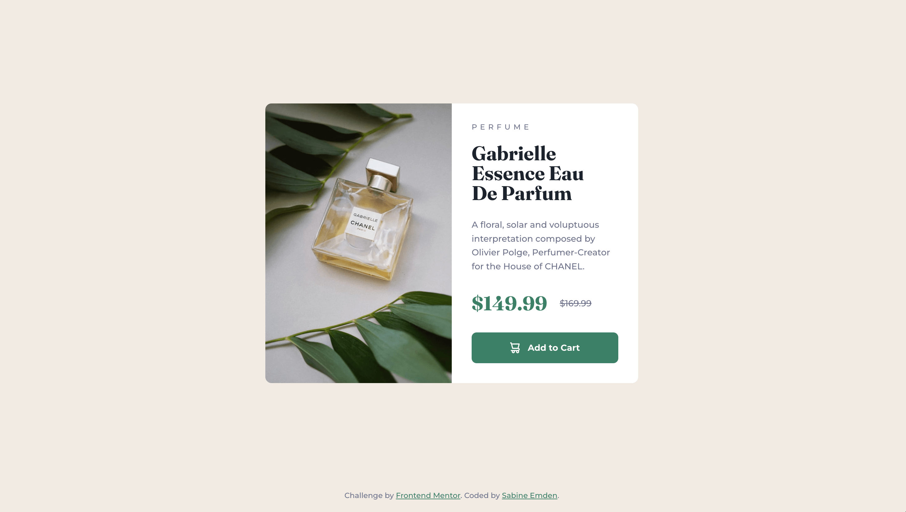

# Frontend Mentor - Product preview card component solution

This is a solution to the [Product preview card component challenge on Frontend Mentor](https://www.frontendmentor.io/challenges/product-preview-card-component-GO7UmttRfa). Frontend Mentor challenges help me improve my coding skills by building realistic projects.

## Table of contents

- [Overview](#overview)
  - [The challenge](#the-challenge)
  - [Screenshot](#screenshot)
  - [Links](#links)
- [My process](#my-process)
  - [Built with](#built-with)
  - [What I learned](#what-i-learned)
  - [Continued development](#continued-development)
  - [Useful resources](#useful-resources)
- [Author](#author)
- [Acknowledgments](#acknowledgments)

## Overview

### The challenge

The brief for this project was to build out the product preview card component and get it looking as close to the design as possible, starting with the following assets:

- Figma design file access
- JPEG design files for mobile & desktop layouts
- Style guide for fonts, colors, etc.
- Optimized image assets
- HTML file with pre-written content

Users should be able to:

- View the optimal layout depending on their device's screen size
- See hover and focus states for interactive elements

### Screenshot

### Links

- [Frontend Mentor solution]()
- [Live site](https://sabineemden.github.io/fm-product-preview-card-component/)

## My process

### Built with

- Semantic HTML5 markup
- CSS custom properties
- Flexbox
- CSS Grid
- Mobile-first workflow
- Responsive media with the picture element

### What I learned

I solved this challenge as part of the Frontend Mentor learning path "[Building responsive layouts](https://www.frontendmentor.io/learning-paths/building-responsive-layouts--z1qCXVqkD)". It is the first of four challenges in the learning path and focuses on:

- Mobile-first workflow
- Media queries and breakpoints
- Responsive images and the picture element

These topics are not new to me. I already encountered them in my solution to the [Stats preview card component challenge](https://github.com/SabineEmden/fm-stats-preview-card-component).

### Continued development

Building web layouts that are flexible and work well across all screen sizes is a fundament skill in front-end web development. I will be able to use it in all my future web development projects.

### Useful resources

- [Inclusively Hidden](https://www.scottohara.me/blog/2017/04/14/inclusively-hidden.html) by Scott O'Hara - This article describes how to hide content from sighted users while allowing screen readers and other assistive technology to discover and interact with the content.

## Author

I'm an aspiring web developer and a former chemist. What I bring from chemistry to software development is a systematic approach to problem solving and the perseverance to not give up easily.

- Frontend Mentor - [@SabineEmden](https://www.frontendmentor.io/profile/SabineEmden)
- Personal Website - [Sabine Emden](https://www.sabineemden.com/)
- Mastodon - [@sabineemden](https://social.tchncs.de/@sabineemden)

## Acknowledgments

This solution uses Josh Comeau's [CSS reset](https://www.joshwcomeau.com/css/custom-css-reset/).

The typefaces used in this project are [Montserrat](https://fonts.google.com/specimen/Montserrat) and [Fraunces](https://fonts.google.com/specimen/Fraunces). These fonts are licensed under the [Open Font License](https://openfontlicense.org/).
